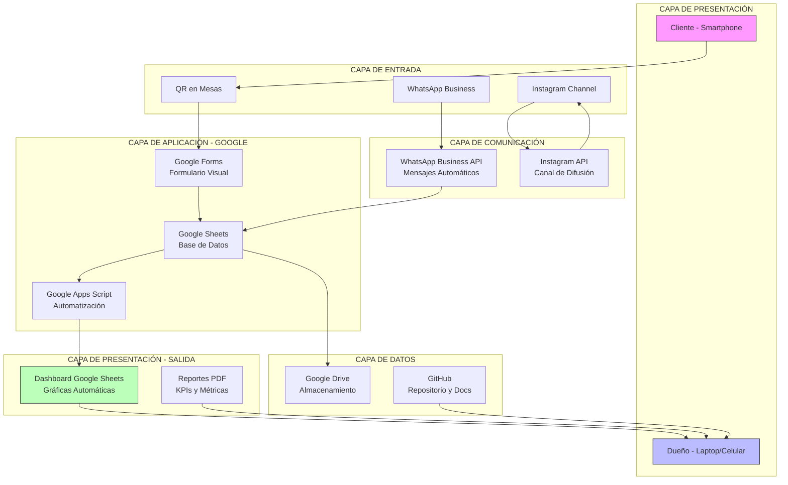

# Arquitectura de la Solución - Suscuni

## Diagrama de Componentes

## Descripción de Componentes

### 1. Servidores de Aplicación
- **Google Forms:** Servidor de formularios en la nube
- **Google Sheets:** Servidor de base de datos y cálculo
- **WhatsApp Business API:** Servidor de mensajería
- **GitHub:** Servidor de repositorio y control de versiones

### 2. Servidores Web
- **Google Drive:** Almacenamiento de archivos
- **Instagram:** Plataforma de redes sociales
- **Travis-CI:** Servidor de integración continua

### 3. Repositorios
- **GitHub:** `github.com/[tu-usuario]/proyecto-suscuni`
  - Branches: main, develop, master
  - Issues: Gestión de requerimientos
  - Projects: Tablero Kanban
  - Wiki: Documentación técnica

### 4. Clientes
- **Cliente Final:** Smartphone con cámara y navegador
- **Coach Empresarial:** Laptop o smartphone para ver dashboards
- **Estudiante:** Laptop para desarrollo y gestión

## Flujo de Datos

1. Cliente escanea QR → Google Forms
2. Google Forms → Google Sheets (automático)
3. Google Sheets → Gráficas automáticas
4. Dueño consulta Google Sheets → Toma decisiones
5. Dueño publica en Instagram → Clientes reciben
6. Cliente escribe WhatsApp → Respuesta automática
7. Todo documentado en GitHub → Trazabilidad

## Tecnologías Utilizadas

| Capa | Tecnología | Función |
|------|------------|---------|
| Frontend | Google Forms | Captura de datos |
| Backend | Google Sheets | Procesamiento y almacenamiento |
| Automatización | Google Apps Script | Scripts automáticos |
| Comunicación | WhatsApp Business | Mensajería automatizada |
| Difusión | Instagram Channel | Anuncios |
| Documentación | GitHub | Repositorio y control |
| CI/CD | Travis-CI | Integración continua |

## Seguridad

- **Autenticación:** Cuentas de Google del dueño
- **Autorización:** Acceso restringido a Google Sheets
- **Encriptación:** HTTPS en todas las plataformas
- **Privacidad:** Datos de clientes opcionales
- **Respaldo:** Google Drive (automático)
